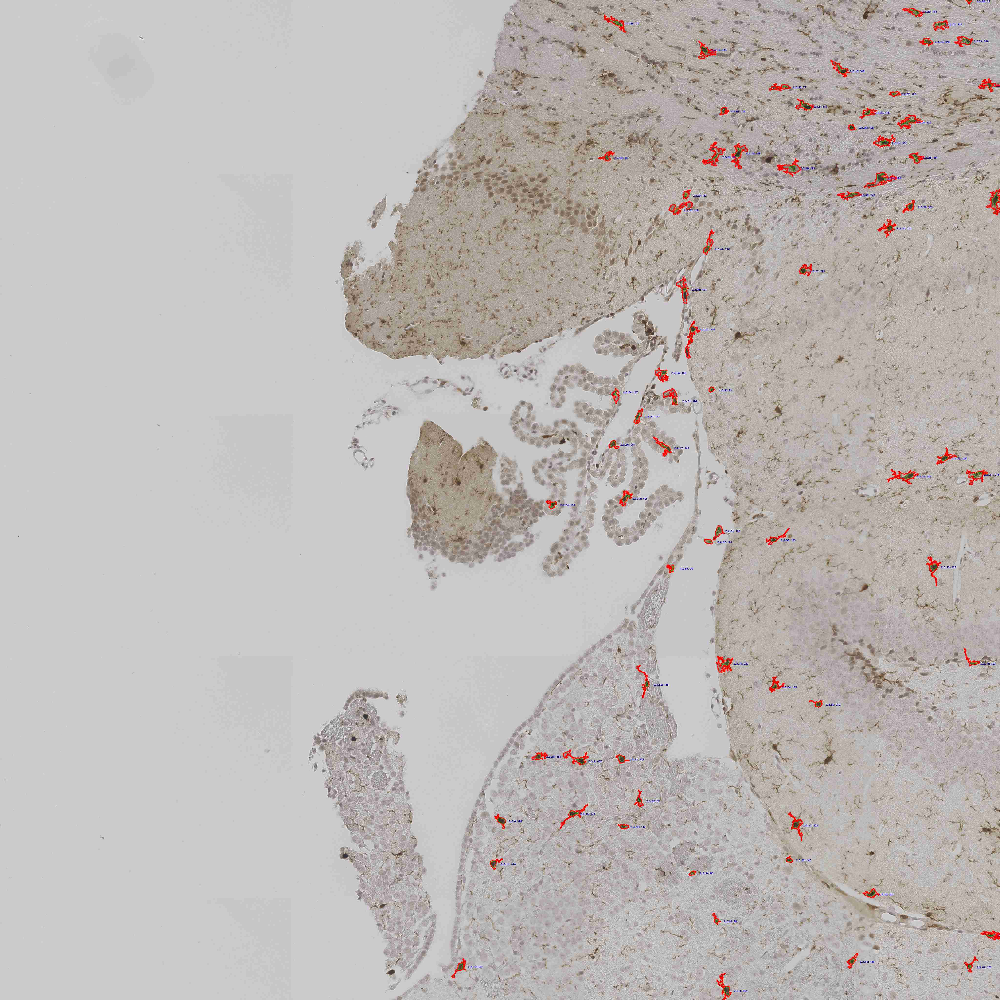

# TissueAnalysis

This project is a digital pathology image analysis pipeline, designed to process high-resolution histology images stained with Hematoxylin and DAB (Diaminobenzidine), typically used in immunohistochemistry (IHC).

## Example Outputs

### Raw Image

### Painted BGR Visualization

### Body Mask

### Cores Mask

### Installation

- Use python 3.13.5
- Install requirements

### Running
- Change folder location: folder_tissue_analysis -> DEFAULT_PATH
- Run folder_tissue_analysis 
